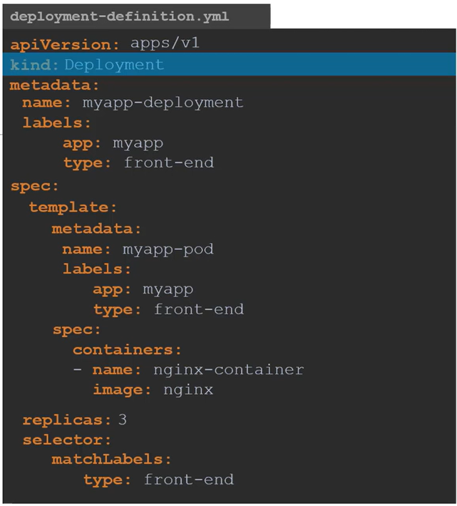
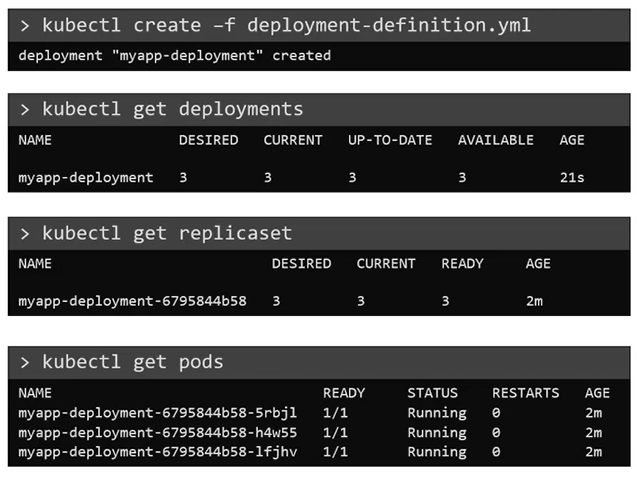

# Understanding Deployments in Kubernetes: Simplified Explanation


Deployments in Kubernetes are like the conductors of an orchestra, orchestrating the deployment and management of your applications with ease. Let's break down what Deployments are and how they work using a simple example:

## What are Deployments?
Imagine you have a web server application that you want to deploy in a production environment. Instead of just one instance, you need several instances running simultaneously for reliability and scalability. This is where Deployments come in. Deployments help you manage multiple instances of your application effortlessly. They ensure that your application is always available and can handle any number of users accessing it at the same time.

While ReplicaSets ensure a specific number of identical Pod replicas are running at all times, Deployments provide a higher-level abstraction for managing application deployment and scaling. Deployments offer additional capabilities such as rolling updates, rollbacks, and coordinated changes, making them more versatile and suitable for complex deployment scenarios.


## Use Cases of Deployments
Now, let's see how Deployments make life easier for you in different scenarios:

### Seamless Upgrades: 
Suppose you've made some improvements to your web server application and want to roll out a new version. With Deployments, you can upgrade your application instances one by one, without disrupting the entire service. This is like upgrading your car's tires while it's still moving!
### Quick Rollbacks: 
Sometimes, updates don't go as planned and can cause issues. Deployments allow you to quickly roll back to a previous version of your application if something goes wrong. It's like hitting an undo button on your computer to revert to a previous saved version.
### Coordinated Changes: 
Let's say you need to make multiple changes to your environment, such as upgrading your web server software, adding more instances for increased traffic, and adjusting resource allocations. Deployments let you make these changes together, ensuring everything is in sync and running smoothly.

By using Deployments, you can manage your applications with confidence, knowing that Kubernetes has your back, ensuring reliability, scalability, and seamless updates.


## Creating a Deployment in Kubernetes

To deploy applications in Kubernetes, you can use Deployments. Here's a simple guide on how to create a deployment definition file and deploy it in your Kubernetes cluster.

### Steps:

1. **Create Deployment Definition File**: Start by creating a YAML file to define your deployment. The file should include the necessary specifications for your deployment, such as the API version, kind, metadata, and spec. The contents of the deployment-definition file 
are exactly similar to the replicaset definition file, except for the kind, which is now 
going to be Deployment. Below is an example of a deployment definition file:



2. **Run kubectl Create Command**: Once you've created the deployment definition file, apply it to your Kubernetes cluster using the following command:
   
    ```bash
    kubectl apply -f deployment-definition.yaml
    ```

3. **Check Deployment Status**: After applying the deployment, verify its status using the following command:
   
    ```bash
    kubectl get deployments
    ```


4. **Check ReplicaSet**: Deployments automatically create a ReplicaSet. Confirm the creation of the ReplicaSet using the following command:
   
    ```bash
    kubectl get replicaset
    ```

5. **Check Pods**: Finally, ensure that Pods have been created by the ReplicaSet using the following command:
   
    ```bash
    kubectl get pods
    ```

Here is the expected output of the above command:



By following these steps, you can create and manage deployments effectively in your Kubernetes cluster.

