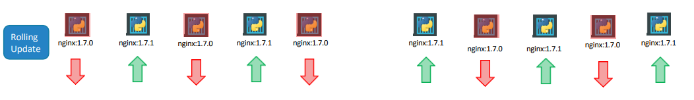

# Understanding Updates, Rollouts, and Rollback in Kubernetes

In Kubernetes, deployments are essential for managing application updates and ensuring continuous availability. Let's delve deeper into deployments, rollouts, and strategies with examples from the provided transcript.


Before diving into application upgrades, it's essential to grasp the concepts of rollouts and versioning in Kubernetes deployments. Let's explore how rollouts work and how versioning enables effective management of deployments.

## Rollouts

- **Definition**: A rollout is triggered whenever a new deployment is created or existing deployments are upgraded. It involves the gradual deployment or upgrade of application containers.


- **Deployment Revisions**: Each rollout creates a new deployment revision. For example, when you first create a deployment, it initiates a rollout, resulting in the creation of Revision 1. Subsequent upgrades trigger new rollouts, leading to the creation of additional revisions, such as Revision 2.
- **Tracking Changes**: Deployment revisions allow us to track the changes made to our deployment over time. This tracking is crucial for auditing purposes and enables us to rollback to a previous version if needed.


## Viewing Rollout Status and History

- **Rollout Status**: To check the status of a rollout, you can use the following command:

    ```
    kubectl rollout status deployment/<deployment-name>
    ``` 
    This command provides real-time updates on the progress of the rollout.


- **Rollout History**: To view the revisions and history of a rollout, use the following command:

     ```
     kubectl rollout history deployment/<deployment-name>
     ```
    
    This command displays a chronological list of revisions, allowing you to analyze past changes and deployments.


## Deployment Strategies

- **Recreate Strategy:** Imagine you have 5 replicas of your web application deployed. Using the Recreate strategy, all existing instances are destroyed first, followed by the deployment of new instances. However, this results in downtime during the transition period.

    


- **Rolling Update Strategy:** Unlike the Recreate strategy, the Rolling Update strategy replaces the older version with the newer one gradually, one instance at a time. This ensures uninterrupted availability during the update process.

    

Remember, if we do not specify a strategy while creating the deployment, it will assume it to be Rolling Update. In other words, RollingUpdate is the default Deployment Strategy.


The difference between the recreate and rollingupdate strategies can also be seen when you view the deployments in detail. Run the `kubectl describe deployment <deployment-name>` command to see detailed information regarding the deployments. You will notice when the Recreate strategy was used the eventsindicate that the old replicaset was scaled down to 0 first and the new replica set scaled up to 5. However when the RollingUpdate strategy was used the old replica set was scaled down one at a time simultaneously scaling up the new replica set one at a time.


## Updating the Deployment and Rollback 
- **Update:** When creating a deployment, under the hood, Kubernetes automatically generates a ReplicaSet and deploys the specified number of Pods. During an upgrade, a new ReplicaSet is created to deploy containers while gradually scaling down the old ReplicaSet.

    

    This can be seen when we try to list the replicasets using the `kubectl get replicasets` command. Here we see the old replicaset with 0 PODs and the new replicaset with 5 PODs:

    


- **Rollback:** What if we realize something isn’t very 
right, once we upgrade your application? There could be something’s wrong with the new version of build you used to upgrade. Then we would like to rollback our update.

    Kubernetes deployments allow us to rollback to 
a previous revision. To undo a change run the command `kubectl rollout undo deployment/<deployment-name>`. The deployment will then destroy the PODs in the new replicaset and bring the older ones up in the old replicaset. And our application is back to its older format.

    

    When we compare the output of the `kubectl get replicasets` command, before and after the rollback, we will be able to notice this difference. Before the rollback the first replicaset had 0 PODs and the new replicaset had 5 PODs and this is reversed after the rollback is finished.

    Before rollback:
    

    After rollback:
    


##  Command Summary
- Create a new deployment:
    ```
    kubectl create –f deployment-definition.yml
    ```


- List all deployments in the cluster:
    ```
    kubectl get deployments
    ```

- Apply changes or update the image of a deployment:
    ```
    kubectl apply –f deployment-definition.yml
    ```
    ```
    kubectl set image deployment/myapp-deployment nginx=nginx:1.9.1
    ```


- Check the status and history of ongoing rollouts:
    ```
    kubectl rollout status deployment/myapp-deployment
    ```
    ```
    kubectl rollout history deployment/myapp-deployment
    ```


- Rollback a deployment to a previous state:
    ```
    kubectl rollout undo deployment/myapp-deployment
    ```


By understanding these concepts and commands, we can effectively manage deployments in Kubernetes, ensuring seamless updates and high availability for your applications.