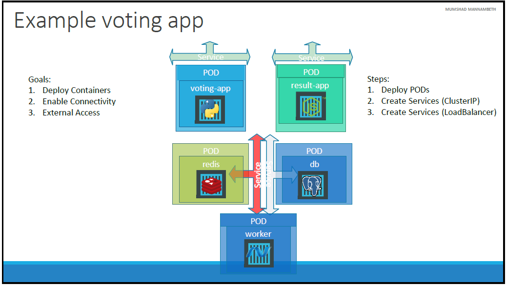
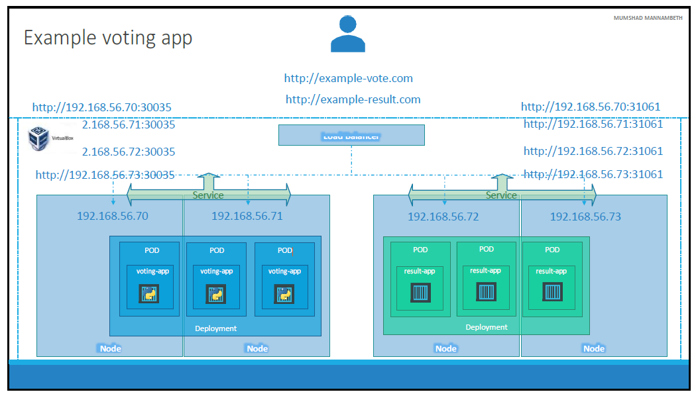
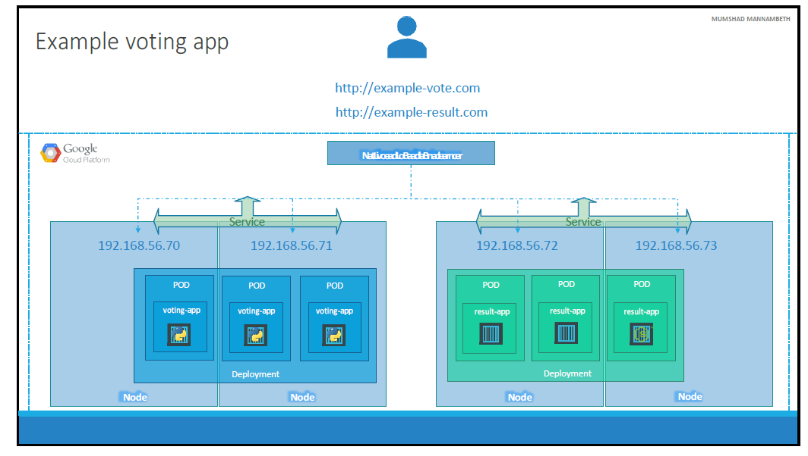

# What is Microservices Architecture?

Microservices architecture is a design pattern for building distributed systems that emphasizes building small, independent services that communicate with each other using well-defined interfaces. Each microservice is a self-contained unit of functionality that can be developed, deployed, and scaled independently of the other services in the system.

## What is microservices architecture used for?

Typically, microservices are used to speed up application development. Microservices architectures built using Java are common, especially Spring Boot ones. It’s also common to compare microservices versus service-oriented architecture. Both have the same objective, which is to break up monolithic applications into smaller components, but they have different approaches. Here are some microservices architecture examples:

## Website migration
A complex website that’s hosted on a monolithic platform can be migrated to a cloud-based and container-based microservices platform.

## Media content
Using microservices architecture, images and video assets can be stored in a scalable object storage system and served directly to web or mobile.

## Transactions and invoices
Payment processing and ordering can be separated as independent units of services so payments continue to be accepted if invoicing is not working.

## Data processing
A microservices platform can extend cloud support for existing modular data processing services.

## An example of Microservice architecture using a simple web application

In this scenario, we're discussing about the implementation of a microservices architecture for front-end applications, specifically a voting-app and a result-app. These applications are deployed as pods on different nodes within a Kubernetes cluster. However, simply accessing these applications via the IP addresses of the nodes and their corresponding ports isn't user-friendly or efficient. Users prefer a single URL like example-vote.com or example-result.com to access these applications.

To achieve this, the traditional approach involves setting up a separate virtual machine (VM) dedicated to acting as a load balancer. On this VM, a suitable load balancer software like HAProxy or NGINX would be installed and configured. The load balancer would then manage the incoming traffic, routing it to the appropriate nodes and then to the pods hosting the applications.

However, this manual setup process can be complex and time-consuming. Alternatively, on supported cloud platforms like Google Cloud, Kubernetes offers native support for automatically configuring load balancing. By setting the service type for the front-end services to LoadBalancer, Kubernetes handles the configuration of a load balancer automatically. This simplifies the setup process significantly, as Kubernetes interacts with the underlying cloud infrastructure to provision and configure the load balancer.

It's important to note that this automatic configuration of load balancing only works on supported cloud platforms. If you're using an unsupported environment like VirtualBox, setting the service type to LoadBalancer would result in a behavior similar to NodePort, where services are exposed on high-end ports on the nodes, similar to the initial setup without load balancing.
