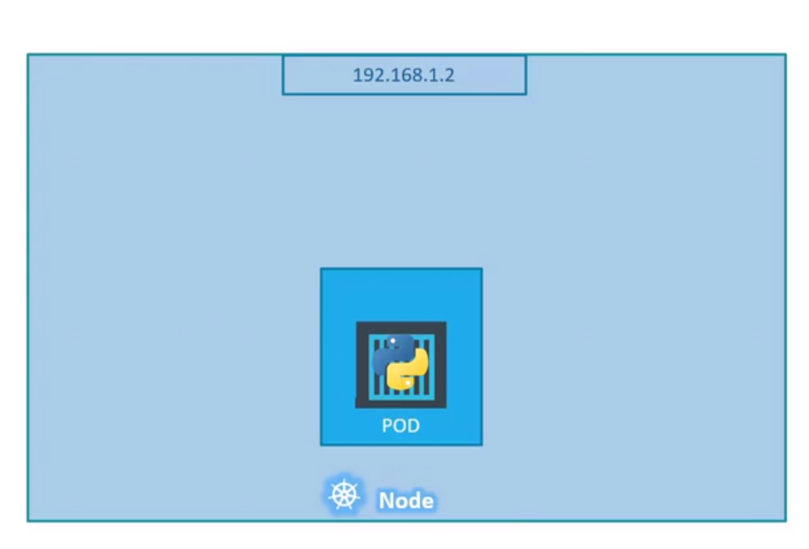
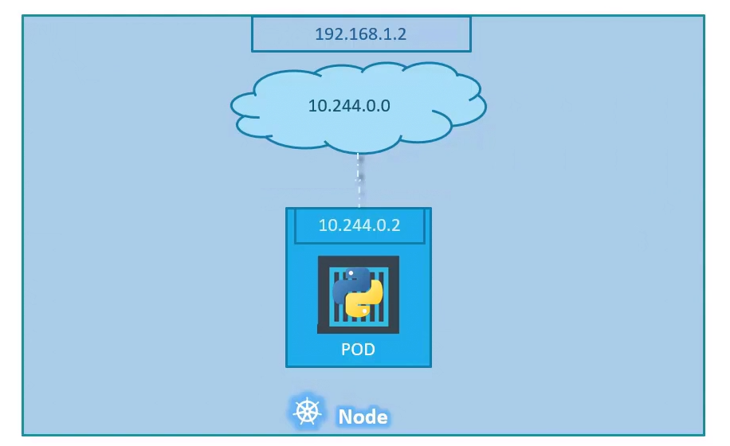
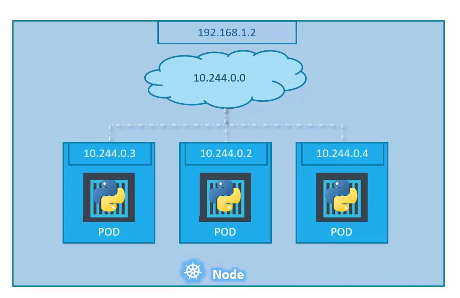
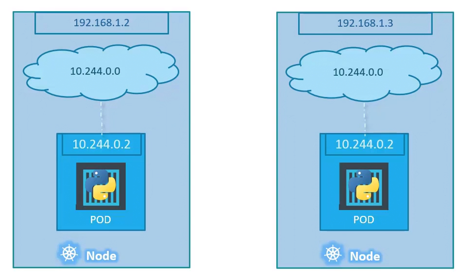
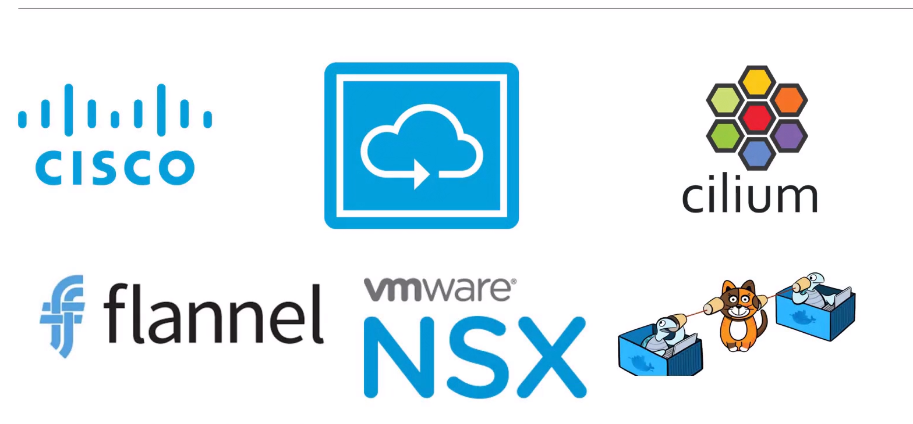

# Networking in Kubernetes.

### 1.Single node Kubernetes cluster

We will start
with a single node Kubernetes cluster. The node has an IP address,
say it is 192.168.1.2 in this case, this is the IP address we use to access the Kubernetes node, SSH into it,etc.

    

 > **Note:** Remember, if we're using a Minikube setup,then it is the IP address of minikube virtual machine.

A pod hosts a container. Unlike in the Docker world where an the IP address
is always assigned to a Docker container.In the Kubernetes world,
the IP address is assigned to a pod. Each pod in the Kubernetes
gets its own internal IP address.

    

In this case,
it's in the range 10.244 series, and the IP assigned to the pod
is 10.244.0.2.

How is it getting this IP address?

When Kubernetes is initially configured, we create an internal private network
with the address 10.244.0.0, and all the pods are attached to it. When we deploy multiple pods, they all get a separate IP
assigned from this network. The pods can communicate
to each other through this IP.But accessing the other pods
using this internal IP address may not be a good idea as it's subject to change
when pods are recreated.

    

### 2.Multiple nodes Kubernetes cluster

In this case, we have two nodes running Kubernetes, and they have IP addresses 192.168.1.2
and 1.3 assigned to them. each of them has a single pod deployed , these pods are attached
to an internal network, and they have
their own IP addresses assigned. However, if we look
at the internal network addresses, we can see that they are the same.

    

The two networks
have an address 10.244.0.0, and the pods deployed
have the same address too. This is will lead to
IP conflicts in the network.

When a Kubernetes cluster is set up, Kubernetes does not automatically set up any kind of networking
to handle these issues. Kubernetes expects us
to set up a networking solution.Kubernetes expects us to set up networking to meet certain fundamental requirements. Some of these are that all the containers
or pods in a Kubernetes cluster must be able to communicate with one another without having to configure NAT. All nodes must be able
to communicate with containers, and all containers must be able to communicate
with the nodes in the cluster. 

Fortunately,
we don't have to set it up all on our own as there are multiple
pre-built solutions available. Some of them are the Cisco ACI networks, Cilium, Big Cloud Fabric, Flannel, VMware NSX-T, and Calico. Depending on the platform we're deploying
our Kubernetes cluster on.

    

The cluster networking
enables communication between the different pods or nodes to meet the networking
requirements of Kubernetes, thus all the pods
now can communicate to each other,by using the assigned IP address.

