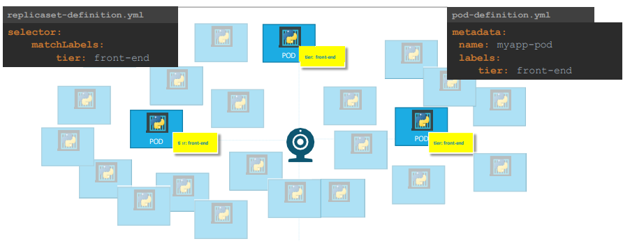

# Understanding Labels and Selectors in Kubernetes

Labels and Selectors play a crucial role in Kubernetes for managing and organizing resources effectively. Let's delve into their significance and how they are used in practical scenarios.

## Why Labeling?
Labels are key-value pairs attached to Kubernetes objects, such as Pods, Services, or ReplicaSets. They serve multiple purposes, including:

1. Organizing Resources: Labels help categorize and organize resources based on different criteria, such as environment, application component, or version.
2. Identifying Resources: Labels provide a way to uniquely identify and reference specific resources within the Kubernetes cluster.
3. Selective Operations: Labels enable selective operations, such as targeting specific Pods for scaling, updating, or monitoring.

## Monitoring PODs with ReplicaSets

Consider a scenario where we deploy multiple instances of a frontend web application as Pods. We want to ensure that we always have three active Pods running to maintain availability. Here's how Labels and ReplicaSets come into play:

The ReplicaSet continuously monitors the labeled Pods. If any Pod fails or becomes unavailable, the ReplicaSet automatically deploys new Pods to maintain the desired number of replicas.

## Importance of Template Section in ReplicaSets

In the ReplicaSet specification, we define three main sections: Template, Replicas, and Selector. The Template section specifies the configuration for new Pods created by the ReplicaSet.

Imagine we have already deployed three Pods matching the ReplicaSet's label selectors. In this case, do we need to include a Template section in the ReplicaSet configuration?
Yes, we do. Even though we have existing Pods, the Template section is essential for future maintenance and scalability. If one of the Pods fails, the ReplicaSet needs the Template definition to create a new Pod to replace it, ensuring that the desired number of Pods is always maintained.

