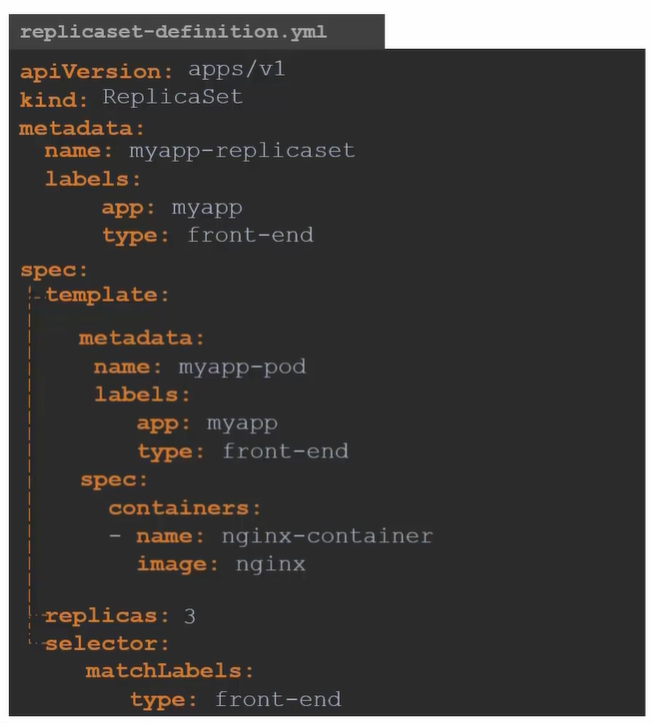

# Understanding ReplicaSets in Kubernetes

Replication Controllers and ReplicaSets serve a similar purpose in Kubernetes, but they are not the same. ReplicaSets are the newer technology replacing Replication Controllers, offering improved functionality and flexibility. 

## Creating ReplicaSets in Kubernetes

ReplicaSets are similar to Replication Controllers but come with some differences. Let's break down the key points:

### Configuration
ReplicaSets follow the standard Kubernetes configuration structure, including apiVersion, kind, metadata, and spec.

1. The apiVersion for ReplicaSets is apps/v1, different from the one used for Replication Controllers (v1). Using the wrong apiVersion can lead to errors.
2. Set the kind to ReplicaSet and provide a name and labels in the metadata section.
### Specifying Replicas
ReplicaSets specify the desired number of replicas (Pod copies) using the spec section, similar to Replication Controllers. For example, we can set the number of replicas to 3.

### Selector Definition
Unlike Replication Controllers, ReplicaSets require a selector definition. This helps the ReplicaSet identify which Pods it should manage.

The selector section matches labels specified in the ReplicaSet configuration with labels on existing Pods.
Even Pods created before the ReplicaSet can be managed if they match the labels specified in the selector.

Here is an example of the definition:



Once the configuration file is ready, execute the following command to apply the configuration from the file:

```
kubectl create -f replicaset-definition.yml
```

To view the list of created Replication Controllers, use the following command:

```
kubectl get replicaset
```

To see the PODs created by the Replication Controller, execute the following command:

```
kubectl get pods
```
