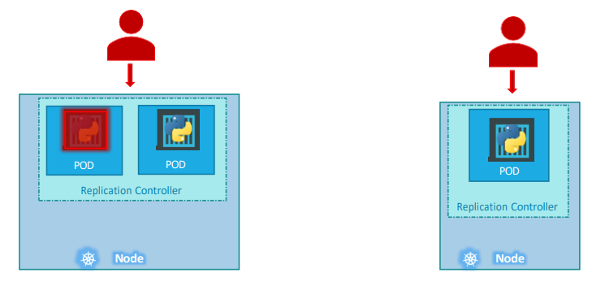
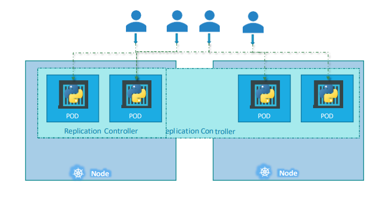
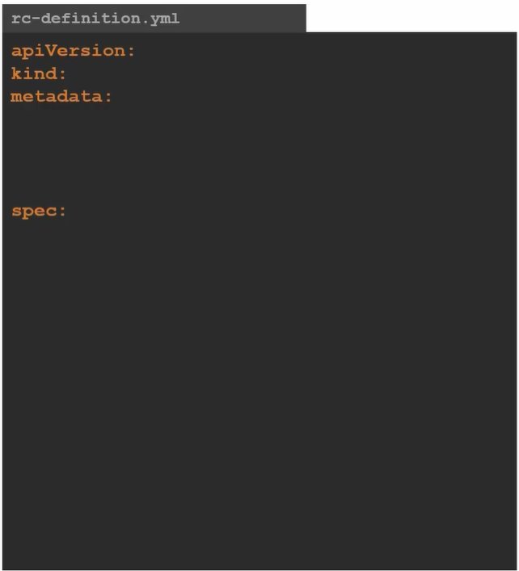
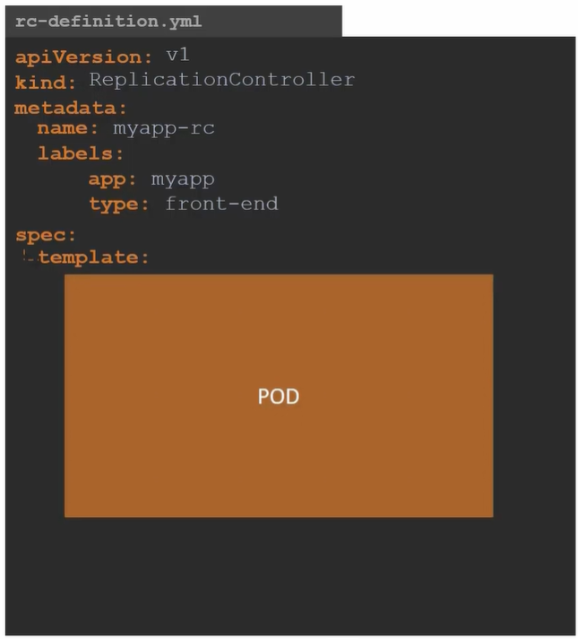
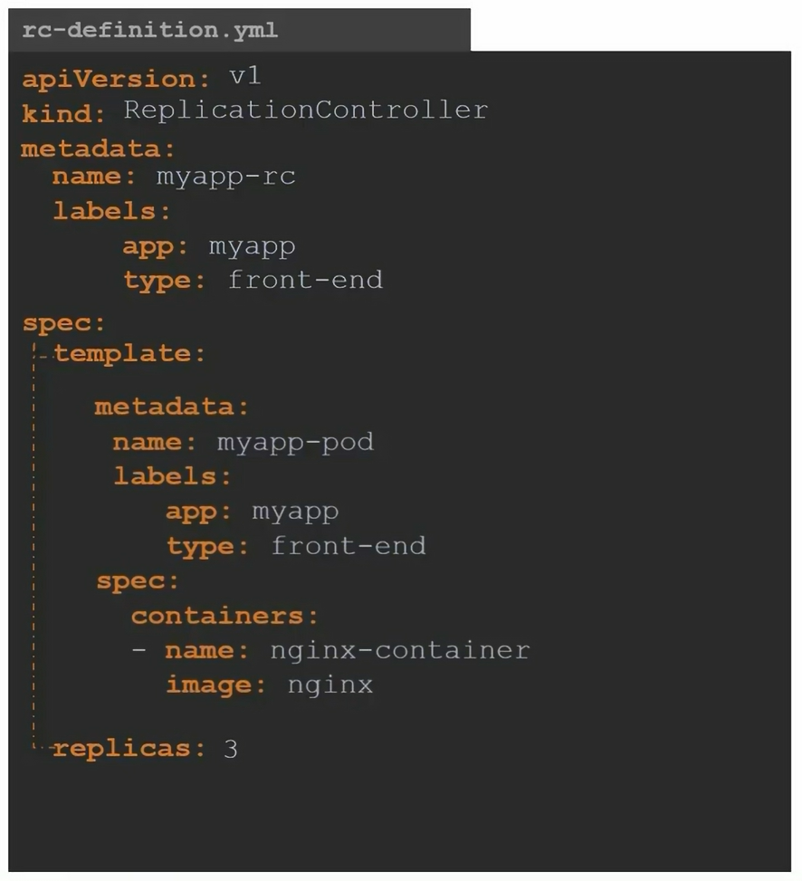
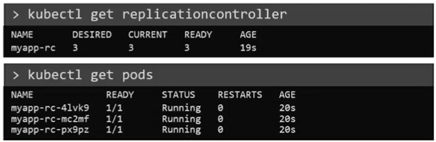

<h1>Replication Controller in Kubernetes</h1>

In this document, we'll dive into the concept of Replication Controllers, their significance, and how they ensure the reliability and scalability of our applications in a Kubernetes environment.

Replication Controllers are a vital component of Kubernetes Controllers, serving as the orchestrators behind the scenes. These controllers continuously monitor Kubernetes objects and take appropriate actions to maintain the desired state of the system. Replication Controllers are like the managers of our application replicas in Kubernetes. They keep an eye on how many copies of our application (PODs) are running and make sure there are enough of them at all times.

<h2>The Need for Replication Controllers</h2>
Consider a scenario where we have a single POD running our application. In the event of a failure, such as the application crashing or the POD becoming inaccessible, users lose access to our application. To mitigate this risk and ensure High Availability, we require multiple instances or replicas of the same POD running concurrently. This is where Replication Controllers come into play.


<h2>Ensuring High Availability</h2>
<p>Replication Controllers facilitate the deployment and management of multiple instances of a single POD within the Kubernetes cluster. By maintaining a specified number of replicas, even if it's just one or a hundred, Replication Controllers ensure that our application remains accessible at all times.</p>



<p>Let’s go back to our 
first scenario were we had a single POD running our application. What if for some reason, our application crashes and the POD fails? Users will no longer be able to access our application. To prevent users from losing access to our application, we would like to have more than one instance or POD running at the same time. That 
way if one fails we still have our application running on the other one. The replication controller helps us run multiple instances of a single POD in the kubernetes cluster thus providing High Availability.So does that mean you can’t use a replication controller if you plan to have a single 
POD? No! Even if you have a single POD, the replication controller can help by automatically bringing up a new POD when the existing one fails. Thusthe replication controller ensures that the specified number of PODs are running at all times. Even if it’s just 1 or 100.</p>

<h2>Load Balancing and Scalability</h2>
<p>Another crucial role of Replication Controllers is load balancing and scalability. As user demand grows, additional PODs are deployed to share the load across multiple instances. If resource constraints are encountered on a particular node, Replication Controllers intelligently deploy additional PODs across other nodes in the cluster, ensuring optimal resource utilization and scalability of our application.</p>



<p>When the number of users increase we deploy additional POD to balance the load across the two pods. If the demand further increases and If we 
were to run out of resources on the first node, we could deploy additional PODs across other nodes in the cluster. As you can see, the replication controller spans across multiple nodes in the cluster. It helps us balance the load across multiple pods on different nodes as well as scale our application when the demand increases.</p>

<h2>Creating a Replication Controller in Kubernetes</h2>
<h3>Step 1: Define Replication Controller Configuration</h3>

Create a replication controller definition file. Let's name it `rc-definition.yml`. The configuration file follows the standard structure of Kubernetes definition files, consisting of four sections: `apiVersion`, `kind`, `metadata`, and `spec`.



Set the `apiVersion` to `v1`, as Replication Controllers are supported in Kubernetes API version v1.Specify the `kind` as `ReplicationController`.

Under the `metadata` section, add a name for the Replication Controller, e.g., `myapp-rc`, and include labels such as `app` and `type`.

The crucial part of the definition file is the `spec` section, which defines the desired state of the Replication Controller. Within the `spec` section, create a `template` section to provide a POD template for the Replication Controller to create replicas.




Populate the `template` section with the contents of a pod-definition file, excluding the first two lines (`apiVersion` and `kind`). Ensure that the pod-definition content is intended under the `template` section.

Add a property called `replicas` under the `spec` section to specify the desired number of replicas for the Replication Controller.

Here is the final definition file:




<h3>Step 2: Create the Replication Controller</h3>
Once the configuration file is ready, execute the following command to apply the configuration from the file:

```
kubectl create -f rc-definition.yml
```


<h3>Step 3: Verify Replication Controller and PODs</h3>

1. To view the list of created Replication Controllers, use the following command:

```
kubectl get replicationcontroller
```

2. To see the PODs created by the Replication Controller, execute the following command:

```
kubectl get pods
```


The expected output of these command is given below:




By following these steps, you can create and manage Replication Controllers in Kubernetes to ensure the availability and scalability of your applications.
