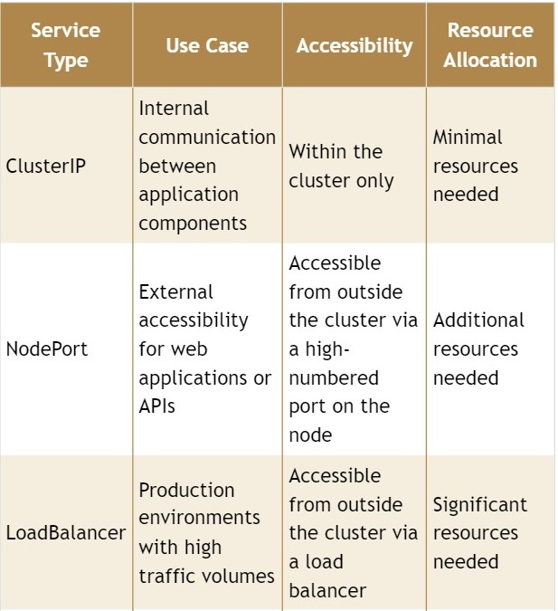

# Services in Kubernetes

## What is services in Kubernetes?
In Kubernetes, a Service is a method for exposing a network application that is running as one or more Pods in your cluster.

A key aim of Services in Kubernetes is that you don't need to modify your existing application to use an unfamiliar service discovery mechanism. You can run code in Pods, whether this is a code designed for a cloud-native world, or an older app you've containerized. You use a Service to make that set of Pods available on the network so that clients can interact with it.

If you use a Deployment to run your app, that Deployment can create and destroy Pods dynamically. From one moment to the next, you don't know how many of those Pods are working and healthy; you might not even know what those healthy Pods are named. Kubernetes Pods are created and destroyed to match the desired state of your cluster. Pods are ephemeral resources (you should not expect that an individual Pod is reliable and durable).

Each Pod gets its own IP address (Kubernetes expects network plugins to ensure this). For a given Deployment in your cluster, the set of Pods running in one moment in time could be different from the set of Pods running that application a moment later.

This leads to a problem: if some set of Pods (call them "backends") provides functionality to other Pods (call them "frontends") inside your cluster, how do the frontends find out and keep track of which IP address to connect to, so that the frontend can use the backend part of the workload?

Enter Services.

## Types of Services

### NodePort
NodePort is a straightforward way to make your application accessible from outside the Kubernetes cluster. It exposes a specific port on each worker node, allowing external traffic to reach your application. Think of it as opening a door directly to your application on each worker node.

**Key Points:**
- External Accessibility: External traffic, such as web browser requests, can reach your application through the specified port on each worker node.
- Security Consideration: While NodePort provides external access, it's essential to consider security implications as it opens up worker nodes to direct access from the outside world.
- Port Range: NodePort values fall within a predefined range, typically between 30,000 and 32,767.

To demonstrate NodePort functionality, we can deploy a simple web application and expose it using NodePort. This will allow us to access the application from a web browser by going through the NodePort on the worker nodes.

### ClusterIP
ClusterIP is primarily used for communication between different parts of your application within the Kubernetes cluster. It creates a virtual IP address accessible only from within the cluster, enabling services to communicate with each other. It's like having an internal phone system for your services.

**Key Points:**
- Internal Communication: ClusterIP facilitates communication between different services within the Kubernetes cluster.
- Isolated Environment: The virtual IP address created by ClusterIP is accessible only from within the cluster, ensuring isolation from external access.
- Scalability: ClusterIP is scalable and efficient for handling internal communication between various components of your application.

To better understand ClusterIP, we can deploy multiple services within the cluster and demonstrate how they communicate with each other using ClusterIPs.

### LoadBalancer
LoadBalancer distributes incoming traffic across multiple instances of your application, ensuring optimal resource utilization and high availability. It acts as a traffic cop, directing visitors to different servers based on predefined rules.

**Key Points:**

- Traffic Distribution: LoadBalancer evenly distributes incoming traffic across multiple servers or instances of your application.
- High Availability: By spreading the load, LoadBalancer ensures that no single server gets overwhelmed, improving the overall availability and reliability of your application.
- Cloud Integration: LoadBalancer provisions a load balancer for your service in supported cloud providers, making it easy to manage traffic distribution.

For the LoadBalancer demo, we can set up a scalable application and use LoadBalancer to showcase how it distributes incoming traffic among multiple servers, maintaining smooth operation even during peak loads.

## Summary

