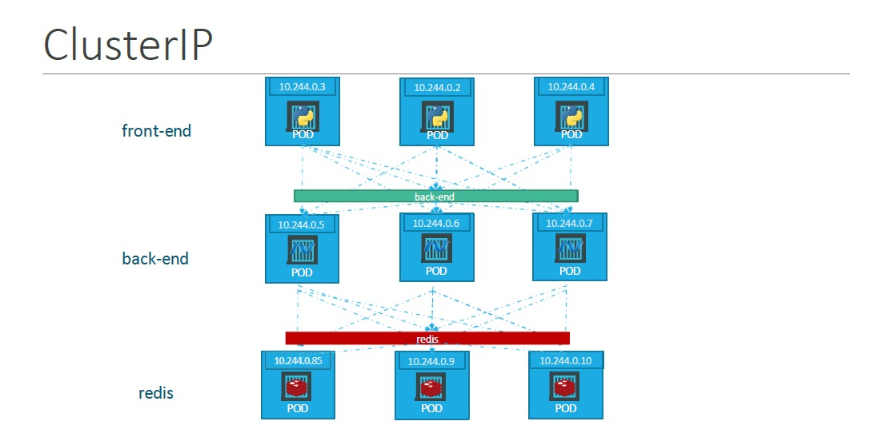

## ClusterIP Services

ClusterIP is the `default` service type in Kubernetes, and it provides internal connectivity between different components of our application. Kubernetes assigns a virtual IP address to a ClusterIP service that can solely be accessed from within the cluster during its creation. This IP address is stable and doesn’t change even if the pods behind the service are rescheduled or replaced.

## Overall Idea

A comprehensive web application typically comprises various types of Pods hosting distinct components of the application architecture. These may include Pods dedicated to front-end web servers, another set allocated for backend servers, Pods hosting key-value stores like Redis, and a separate set designated for persistent databases such as MySQL. The interconnection between these Pods is vital for seamless application functionality.



Each Pod is assigned an IP address, albeit non-static, which poses challenges for establishing consistent internal communication within the application. As Pods may terminate and new ones instantiate dynamically, reliance solely on IP addresses becomes impractical. Moreover, determining which backend service a front-end Pod, for instance, should access presents a decision-making dilemma.

Kubernetes offers a solution through Services, which serve to `group Pods` and provide a `unified` access point to the Pods within a group. For instance, creating a Service for backend Pods aggregates them, furnishing a `singular interface` for other Pods to communicate with. Requests directed to the Service are distributed randomly among the constituent Pods. Similarly, creating Services for Redis facilitates backend Pods' access to the Redis system. This approach streamlines the deployment of microservices-based applications on a Kubernetes cluster.

Each Service is endowed with an internal IP address and a name within the cluster. This designated name becomes the standardized means for other Pods to access the Service. Such Services, configured as ClusterIPs, foster robust and efficient communication between the various components, ensuring scalability and resilience across the application layers.

## An example use case

Let's consider a scenario where you have two microservices within your Kubernetes cluster, one responsible for processing user data (`user-service`) and another for processing payment data (`payment-service`). These microservices need to communicate with each other, but they don't need to be exposed to the outside world directly.

You can use a ClusterIP service to facilitate communication between these microservices. Here's an example:

```yaml
apiVersion: v1
kind: Service
metadata:
  name: user-service
spec:
  selector:
    app: user-service
  ports:
    - protocol: TCP
      port: 8080
      targetPort: 8080
---
apiVersion: v1
kind: Service
metadata:
  name: payment-service
spec:
  selector:
    app: payment-service
  ports:
    - protocol: TCP
      port: 8080
      targetPort: 8080
```

In this example, we have two microservices, `user-service` and `payment-service`. Each microservice is exposed internally via a ClusterIP service. These services allow other components within the Kubernetes cluster to communicate with them.

The `user-service` is accessible internally within the cluster at `user-service.default.svc.cluster.local`, and similarly, the `payment-service` is accessible at `payment-service.default.svc.cluster.local`. Other components within the cluster can use these internal DNS names to communicate with the respective microservices without exposing them to the outside world. 