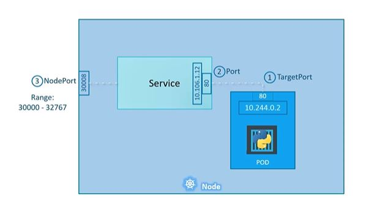
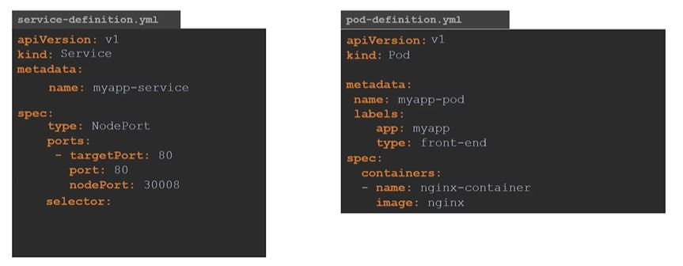
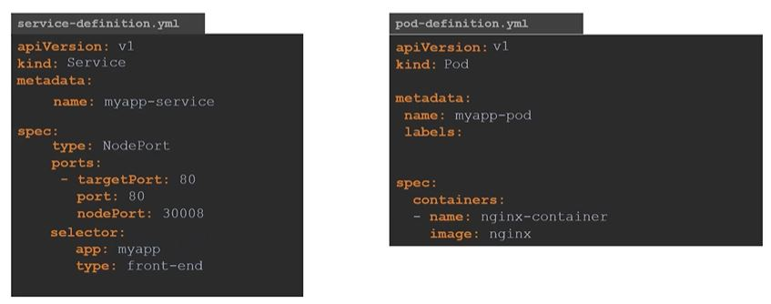
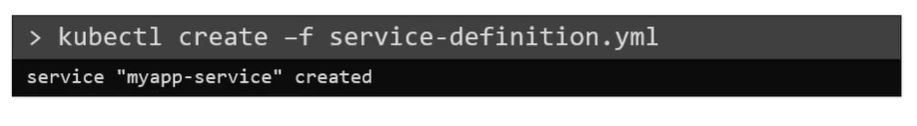
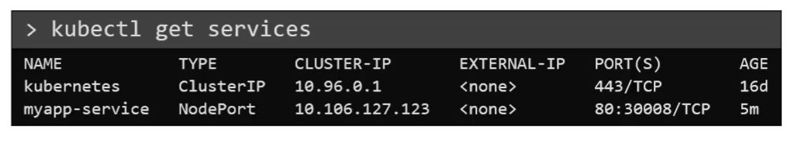
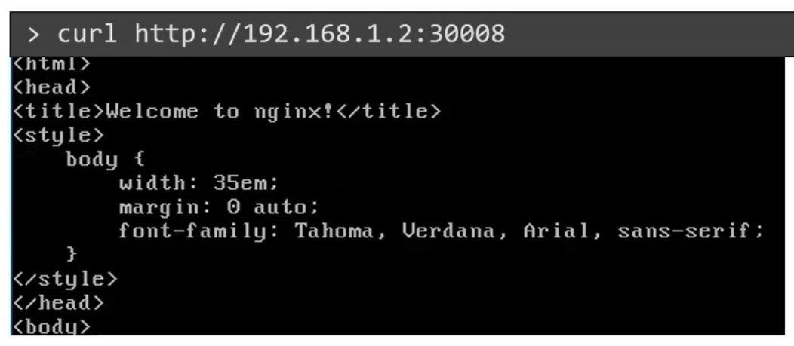
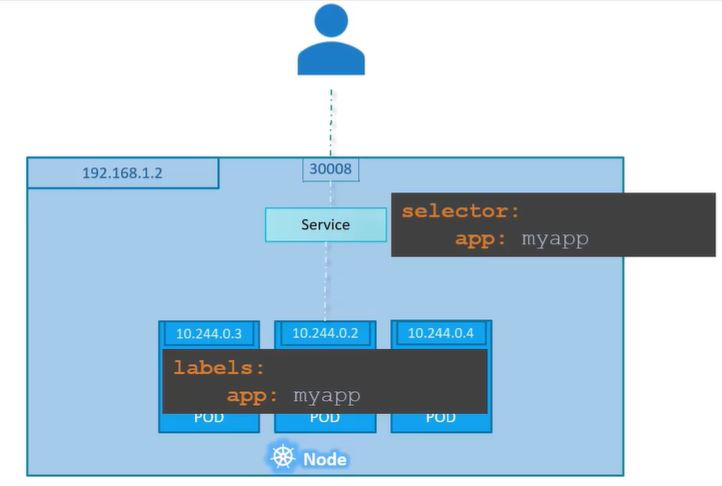
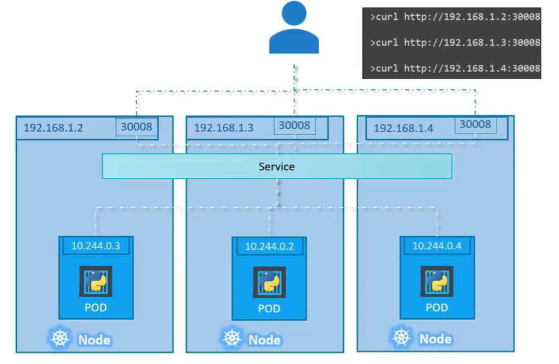

# Service - NodePort



Let’s take a closer look at the Service. If we look at it, there are 3 ports involved. The port on the POD were the actual web server is running is port 80. And it is referred to as the targetPort, because that is were the service forwards the requests to. The second port is the port on the service itself. It is simply referred to as the port.
Remember, these terms are from the viewpoint of the service. The service is in fact like a virtual server inside the node. Inside the cluster it has its own IP address. And that IP address is called the Cluster-IP of the service. And finally we have the port on the Node itself which we use to access the web server externally. And that is known as the NodePort. As you can see it is 30008. That is because NodePorts can only be in a valid range which is from 30000 to 32767.

### How to create a service 



Just like how we created a Deployment, ReplicaSet or Pod, we will use a definition file to create a service.
The high level structure of the file remains the same. As before we have apiVersion, kind, metadata and spec sections. The apiVersion is going to be v1. The kind is ofcourse service. The metadata will have a name and that will be the name of the service. It can have labels, but we don’t need that for now. Next we have spec. and as always this is the most crucial part of the file as this is were we will be defining the actual services and this is the part of a definition file that differs between different objects.

In the spec section of a service we have type and ports. The type refers to the type of service we are creating. As discussed before it could be ClusterIP, NodePort, or LoadBalancer. In this case since we are creating a NodePort we will set it as NodePort. The next part of spec is ports. This is were we input information regarding what we discussed on the left side of this screen. The first type of port is the targetPort, which we will set to 80. The next one is simply port, which is the port on the service object and we will set that to 80 as well. The third is NodePort which we will set to 30008 or any number in the valid range.

Remember that out of these, the only mandatory field is port . If we don’t provide a targetPort it is assumed to be the same as port and if we don’t provide a nodePort a free port in the valid range between 30000 and 32767 is automatically allocated. Also note that ports is an array. So note the dash under the ports section that indicate the first element in the array.
We can have multiple such port mappings within a single service.

### Connect the service to the POD

There is nothing here in the definition file that connects the service to the POD. We have simply specified the targetPort but we didn’t mention the targetPort on which POD. There could be 100s of other PODs with web services running on port 80. So how do we do that?


As we did with the replicasets previously, we will use labels and selectors to link these together. We know that the POD was created with a label. We need to bring that label into this service definition file.

So we have a new property in the spec section and that is selector. Under the selector provide a list of labels to identify the POD. For this refer to the pod- definition file used to create the POD. Pull the labels from the pod-definition file and place it under the selector section. This links the service to the pod.



### Create the service 
Create the service using the kubectl create command and input the service-definition file and there we have the service created.

```bash
kubectl create -f service-definition.yaml
```




To see the created service, run the kubectl get services command that lists the services, their cluster-ip and the mapped ports. The type is NodePort as we created and the port on the node is set to 30008. 

```bash
kubectl get services
```




We can now use this port to access the web service using curl or a web browser.

```bash
curl http://192.168.1.2:30008
```




### Multiple pods in a single node




In this case we have multiple similar PODs running our web application. They all have the same labels with a key app set to value myapp. The same label is used as a selector during the creation of the service. So when the service is created, it looks for matching PODs with the labels and finds 3 of them. The service then automatically selects all the 3 PODs as endpoints to forward the external requests coming from the user. We don’t have to do any additional configuration to make this happen. And if you are wondering what algorithm it uses to balance load, it uses a random algorithm. Thus the service acts as a built-in load balancer to distribute load across different PODs.

### Multiple pods on multiple nodes




And finally, lets look at what happens when the PODs are distributed across multiple nodes. In this case we have the web application on PODs on separate nodes in the cluster. When we create a service , without us having to do ANY kind of additional configuration, kubernetes creates a service that spans across all the nodes in the cluster and maps the target port to the SAME NodePort on all the nodes in the cluster. This way we can access our application using the IP of any node in the cluster and using the same port number which in this case is 30008.

### Conclusion

To summarize – in ANY case weather it be a single pod in a single node, multiple pods on a single node, multiple pods on multiple nodes, the service is created exactly the same without you having to do any additional steps during the service creation. When PODs are removed or added the service is automatically updated making it highly flexible and adaptive. Once created we won’t typically have to make any additional configuration changes.