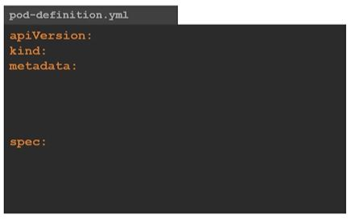
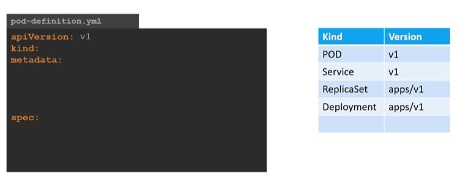
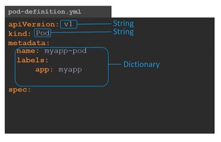
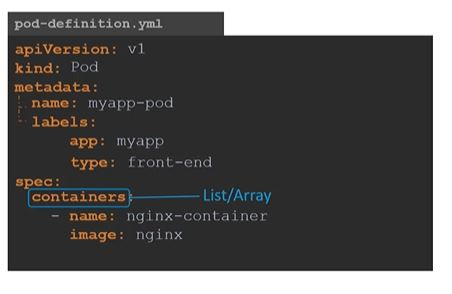
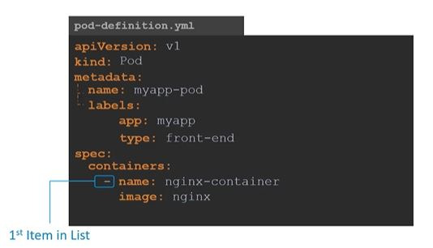
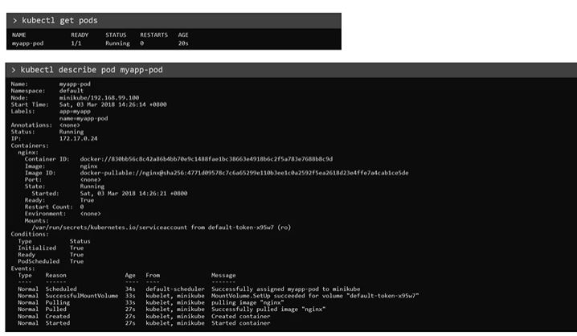

# Kubernetes-Pods

## Pods with YAML

Kubernetes uses YAML files as input for the creation of objects such as PODs, Replicas, Deployments, Services etc. All of these follow similar structure. A kubernetes definition file always contains 4 top level fields. The apiVersion, kind, metadata and spec. These are top level or root level properties. Think of them as siblings, children of the same parent. These are all REQUIRED fields, so we MUST have them in your configuration file.



The first one is the apiVersion. This is the version of the kubernetes API we’re using to create the object. Depending on what we are trying to create we must use the RIGHT apiVersion. For now since we are working on PODs, we will set the apiVersion as v1. Few other possible values for this field are apps/v1beta1, extensions/v1beta1 etc.



Next is the kind. The kind refers to the type of object we are trying to create, which in this case happens to be a POD. So we will set it as Pod. Some other possible values here could be ReplicaSet or Deployment or Service.



The next is metadata. The metadata is data about the object like its name, labels etc. As you can see unlike the first two were you specified a string value, this, is in the form of a dictionary. So everything under metadata is intended to the right a little bit and so names and labels are children of metadata. The number of spaces before the two properties name and labels doesn’t matter, but they should be the same as they are siblings. In this case labels has more spaces on the left than name and so it is now a child of the name property instead of a sibling. Also the two properties must have MORE spaces than its parent, which is metadata, so that its intended to the right a little bit. In this case all 3 have the same number of spaces before them and so they are all siblings, which is not correct. Under metadata, the name is a string value – so you can name your POD myapp-pod - and the labels is a dictionary. So labels is a dictionary within the metadata dictionary. And it can have any key and value pairs as you wish. For now I have added a label app with the value myapp. Similarly you could add other labels as you see fit which will help you identify these objects at a later point in time. Say for example there are 100s of PODs running a front-end
application, and 100’s of them running a backend application or a database, it will be DIFFICULT for you to group these PODs once they are deployed. If you label them now as front-end, back-end or database, you will be able to filter the PODs based on this label at a later point in time.

  

The last section in the configuration file is the specification which is written as spec. Depending on the object we are going to create, this is were we provide additional information to kubernetes pertaining to that object. This is going to be different for different objects, so its important to understand or refer to the documentation section to get the right format for each. Since we are only creating a pod with a single container in it, it is easy. Spec is a dictionary so add a property under it called containers, which is a list or an array. The reason this property is a list is because the PODs can have multiple containers within them. We will only add a single item in the list, since we plan to have only a single container in the POD. The item in the list is a dictionary, so add a name and image property. The value for image is nginx.



Once the file is created, run the command kubectl create -f followed by the file name which is pod-definition.yml and kubernetes creates the pod.

```
kubectl create -f pod-definition.yml
```

